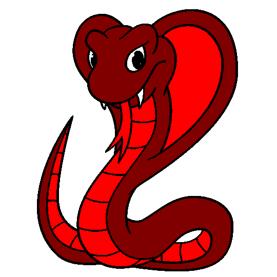
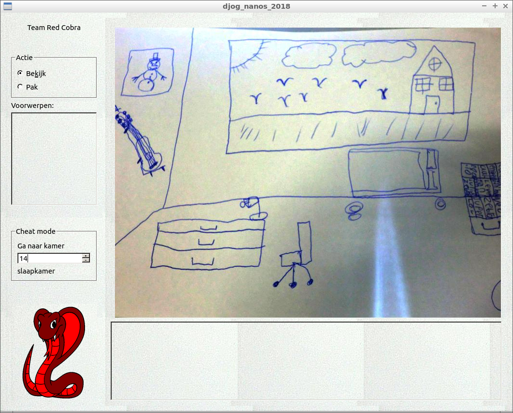
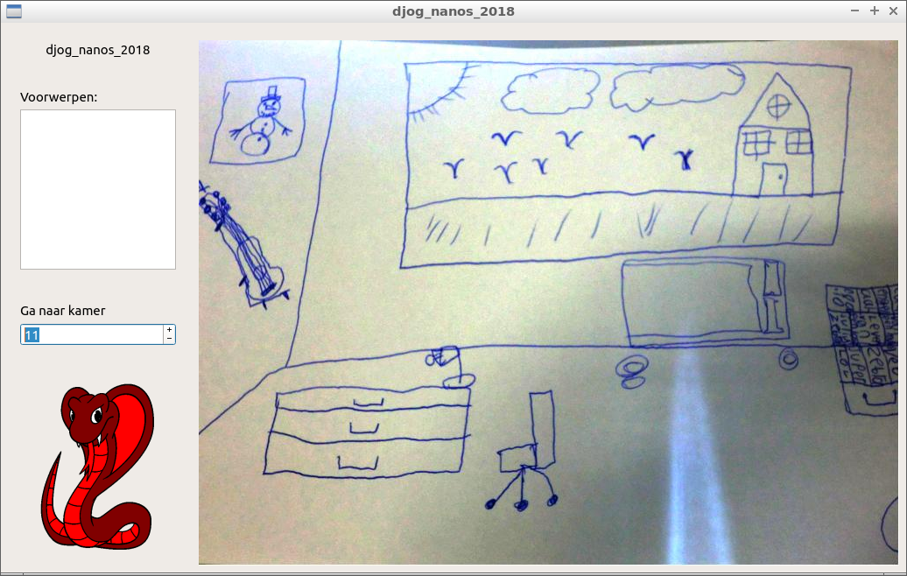
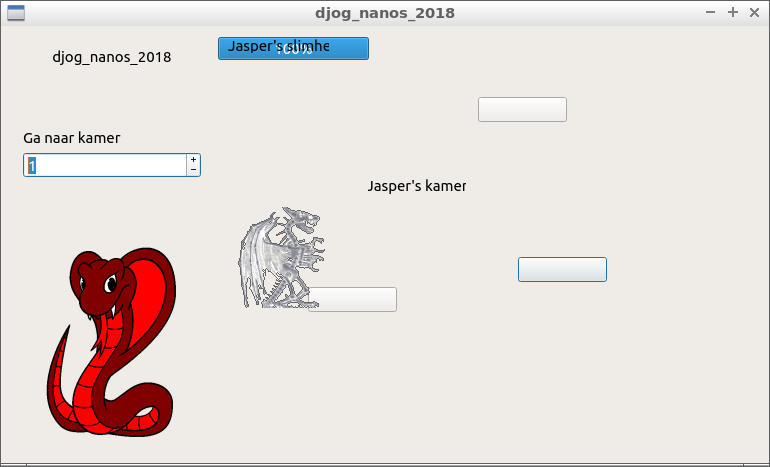
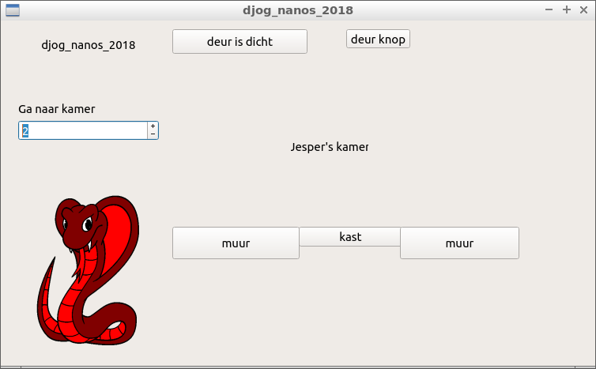
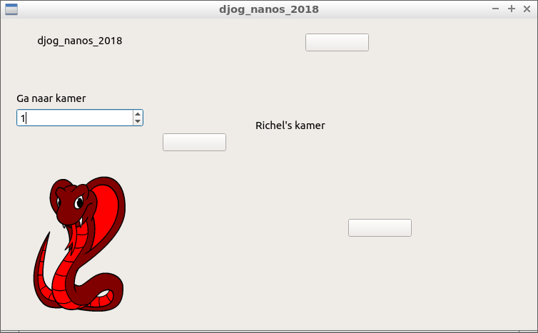

# Red-Cobra

The very best Red Cobra group. We work at DJOG are senior Programers

Gezamelijk project van de jongere/tieners 
op de donderdagavond van de [Dojo](https://github.com/richelbilderbeek/Dojo) in schooljaar 2018-2019.

`git` branches:

Branch|||
---|---|---|---
`master`| | |

## Doel

Samen een adventure game maken, die zich afspeelt in de toekomst, met
een steampunk thema.

  * [gedrag](doc/gedrag.md)
  * [git](doc/git.md)
  * [planning](doc/planning.md)
  * [team](team/README.md)
  * [video's](doc/videos.md)

## Team

### GitHub namen

Naam   |GitHub naam
-------|------------------
Bruno  |[@brunoHacker](https://github.com/brunoHacker)
Daan   |[@daantje1](https://github.com/daantje1)
Jasper |[@Brainlab009](https://github.com/Brainlab009)
Jesper |[@jesperdoekes](https://github.com/jesperdoekes)
Jonas  |[@jojojonie](https://github.com/jojojonie)
Judith |[@judithbonga](https://github.com/judithbonga)
Kyrill |[@RedKnife47](https://github.com/RedKnife47)
Mees   |[@mixmastermees](https://github.com/mixmastermees)
Oliver |[@ollyturner](https://github.com/ollyturner)
Richel |[@richelbilderbeek](https://github.com/richelbilderbeek)
Seny   |[@S3NY7](https://github.com/S3NY7)

### Hoofdtaken

Op voornaam, op alfabet:

Naam   |Taken
-------|---
Bruno  |Junior dev, graphics
Daan   |Medior dev
Jasper |Junior dev
Jesper |Medior dev
Jonas  |Junior dev, graphics
Judith |Junior dev
Kyrill |Junior dev
Mees   |Medior dev, opstarten
Oliver |Junior dev, verhaal, Engels
Richel |Senior dev
Seny   |Junior dev, verhaal

Taak|Omschrijving
---|---
Dev (Junior)|Doet gemakkelijke veranderingen in de code
Dev (Medior)|Doet moeilijkere veranderingen in de code, leidt de junior devs op
Dev (Senior)|Bepaalt de veranderingen in de code, leidt de medior devs op
Engels|Helpt met het vertalen van moeilijk Engels naar Nederlands
`git` 1|Helpt met de basis van `git`: het `clone-add-commit-push-pull` rondje
`git` 2|Helpt met `git` branches: het `status-checkout-merge` rondje
Graphics|Bepaalt hoe de graphics eruit moeten komen te zien
Opstarten|Helpt een nieuw teamlid opstarten
Project|Helpt met hoe de 'Project' pagina werkt
UI|'User Interface': hoe het spel eruit ziet
Verhaal|Bepaalt het verhaal

## Kamers

In het huis zijn de volgende kamers:

 * :warning: Kamernamen staan op alfabet

Kamernaam               |Programmeur | Verhaal |Graphics
------------------------|----------- |---------|-------------
Garage                  | Mees       | Jonas   | Jonas
Hal                     | Jasper     | Jasper  | Bruno
Laboratorium (in kelder)| Mees       | Mees    | Judith
Slaapkamer (van jezelf) | Jesper     | Bruno   | Bruno
Slaapkamer (van ouders) | Bruno      | Judith  | Judith

 * Programmeur: programmeert de kamer
 * Graphics: teken het achtergrondplaatje en voorwerpen
 * Verhaal: bepaal het verhaal in de kamer

## Kamers

Staan in [verhaal.md](verhaal.md).

## Plaatjes

Plaatjes moeten precies 800 pixels breed en 600 pixels hoog zijn.

## Voortgang

## Links

 * [C++ voor jonge tieners](https://github.com/richelbilderbeek/cpp_voor_jonge_tieners)
 * [Dojo](https://github.com/richelbilderbeek/Dojo)
 * [git voor jonge tieners](https://github.com/richelbilderbeek/git_voor_jonge_tieners)
