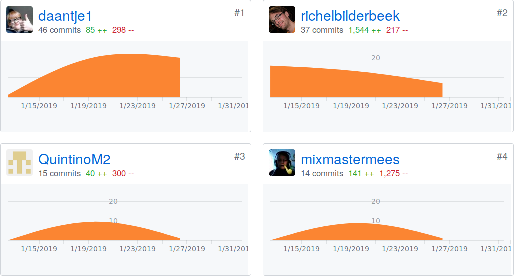

# daan

In deze folder kun je je eigen code en aantekeningen kwijt.

# Git
in git werk je samen in een github cloud (server) 
# Handleiding
de handleiding.
# Committen
commiten, het is dat je bestanden naar de server ""Pusht",
om dit te doen,
klik even op deze link:
https://github.com/richelbilderbeek/djog_nanos_2018/blob/master/auto_commit.md
